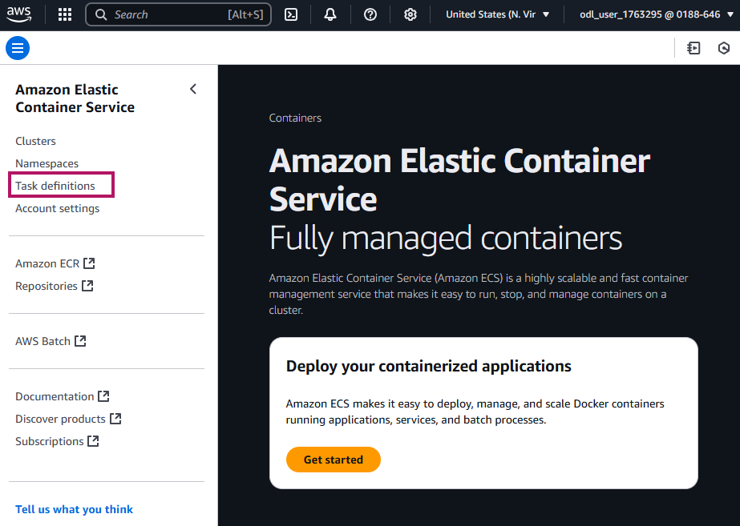

# AWS DevOps 

## Overview

This project integrates various AWS services and DevOps practices to deliver a modern infrastructure that supports CI/CD, containerization, configuration management, and Infrastructure as Code (IaC).

## Tools & Technologies Used

| Category                   | Tool/Service                           |
|----------------------------|----------------------------------------|
| Version Control            | GitHub                                 |
| Continuous Integration / Delivery | AWS CodePipeline                |
| Containerization           | Amazon ECS (Elastic Container Service) |
| Container Orchestration    | Amazon EKS (Elastic Kubernetes Service)|
| Configuration Management   | Ansible                                |
| Infrastructure as Code     | AWS CloudFormation                     |


## Amazon ECS (Elastic Container Service)

Amazon ECS is a fully managed container orchestration service provided by AWS. It enables you to easily deploy, manage, and scale Docker containers across a cluster of EC2 instances or using AWS Fargate (serverless).

### Key Features

- Supports containerized applications using Docker under the hood.
- Provides flexible deployment models:
  - **EC2 launch type** – Run containers on a managed cluster of EC2 instances.
  - **Fargate launch type** – Run containers without managing servers or clusters.
- Deep integration with other AWS services like IAM, CloudWatch, and ELB.
- Automatically handles cluster management, load balancing, and auto-scaling.

### ECS Workflow

```plaintext
Build Docker Image → Push to ECR (Elastic Container Registry) → Define Task Definition → Deploy on ECS (Fargate or EC2)
```
- Build the Docker image for your application.
- Push the image to Amazon ECR, AWS’s fully managed Docker container registry.
- Create a Task Definition that specifies how the container should run.
- Deploy the task using ECS, either on EC2 or via Fargate for serverless execution.

### ECS Deployment Example
Follow the steps below to build a Docker image, push it to Amazon ECR, and deploy it using Amazon ECS.

**Step 1: Connect to Your EC2 Instance**
```bash
$ sudo su
$ git clone https://github.com/akshu20791/ECS-AWS-LAB
$ cd ECS-AWS-LAB
$ ls # verify the directory
```

**Step 2: Create an Amazon ECR Repository**
- Go to the Amazon ECR service in the AWS Console.
- Create a new repository.
- Click on `View Push Commands`.

***Note*** But before entering these commands in the machine we need to use secret key and access secret key to get access of aws account from the machine.


**Step 3: Configure AWS CLI on EC2**
```bash
$ curl "https://awscli.amazonaws.com/awscli-exe-linux-x86_64.zip" -o "awscliv2.zip"
$ apt install unzip -y
$ unzip awscliv2.zip
$ aws configure # it will ask for accesskey and secret access key.Please provide
```

**Step 4: Install Docker**
```bash
$ apt update
$ apt install docker.io -y
```

**Step 5: Push Docker Image to ECR**
Return to your ECR repository and click `View Push Commands`. Run the following in your EC2 instance (modify values for your AWS account):


***Copy the commands in screenshot above one by one in your machine***
```bash
$ aws ecr get-login-password --region us-east-1 | docker login --username AWS --password-stdin 018864656235.dkr.ecr.us-east-1.amazonaws.com
$ docker build -t awsdevops/ecr-images .
$ docker tag awsdevops/ecr-images:latest 018864656235.dkr.ecr.us-east-1.amazonaws.com/awsdevops/ecr-images:latest
```


**Step 6: Create ECS Cluster and Deploy**
- Go to Amazon ECS in the AWS Console.
- Create a new ECS Cluster.
- Define a Task Definition using the ECR image URL.
- Set resource limits, container port mappings, etc.
- Create a new Service to run the task.
- You can refer to screenshots or the AWS docs for guidance.





**Step 7: Configure Networking & Security & Deploy**
- Create a new security group that allows inbound traffic on the application port (e.g., 8080).
- Attach the security group to the ECS service or task.
- Choose the appropriate VPC and subnet configuration (public if you need external access).


**Final Result**
Once deployed, your application should be accessible via the public IP assigned to the ECS task or Load Balancer.
- Link : http://18.207.139.121:8080/LoginWebApp-1/