# Building a CI/CD Pipeline on AWS with CodePipeline, CodeBuild, and Elastic Beanstalk

This guide provides a step-by-step tutorial for creating a complete CI/CD pipeline on AWS. We will use AWS CodePipeline to automate the build and deployment of a sample web application from a GitHub repository to an AWS Elastic Beanstalk environment.

### Prerequisites

*   An AWS Account with console access.
*   A GitHub account.

---

## AWS Services Overview

Before we begin, let's briefly review the core services we will be using.

### AWS CodePipeline

*   A fully managed continuous integration and continuous delivery (CI/CD) service from AWS.
*   Automates the process of building, testing, and deploying your code every time there is a change.
*   It's a serverless orchestrator, meaning you don't need to manage any underlying servers for the pipeline itself.
*   Integrates seamlessly with other AWS services (like CodeBuild, S3, Elastic Beanstalk) and third-party tools (like GitHub, Jenkins).

### AWS CodeBuild

*   A fully managed continuous integration service that compiles source code, runs tests, and produces software packages that are ready to deploy.
*   Eliminates the need to provision, manage, and scale your own build servers.
*   It is used as a "build stage" within CodePipeline. You only pay for the build minutes you consume.
*   Operates based on a `buildspec.yml` file in your repository, which defines the build commands.

### AWS Elastic Beanstalk

*   An easy-to-use service for deploying and scaling web applications and services.
*   You simply upload your code, and Elastic Beanstalk automatically handles the deployment, from capacity provisioning, load balancing, and auto-scaling to application health monitoring.
*   It provisions the underlying infrastructure for you, including EC2 instances, load balancers, and security groups.

---

## Part 1: Fork the Sample Repository

First, we need a sample application to deploy. We will fork a simple PHP website from a public GitHub repository.

1.  Open the following link in your browser:
    *   https://github.com/akshu20791/apachewebsite

2.  Click the **Fork** button in the top-right corner to create a copy of this repository in your own GitHub account.
    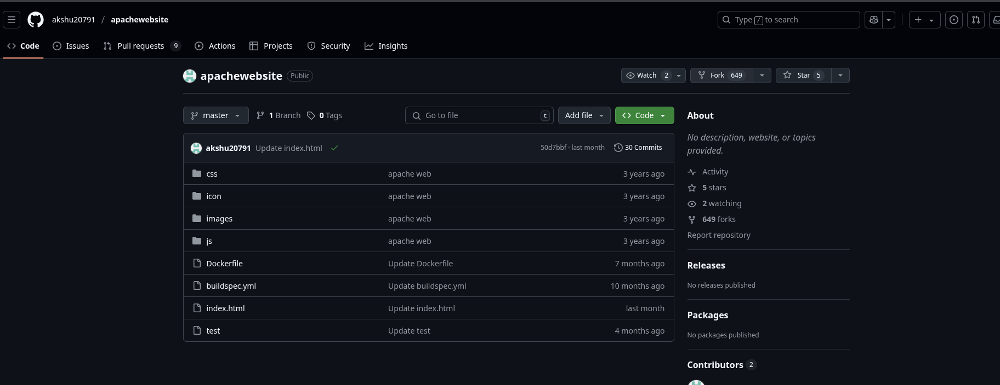

---

## Part 2: Set Up the Deployment Environment with Elastic Beanstalk

Before creating our pipeline, we need a target environment to deploy to. We will create a new PHP environment using AWS Elastic Beanstalk.

1.  In the AWS Console, search for and navigate to the **Elastic Beanstalk** service.

2.  Click **Create application**.
    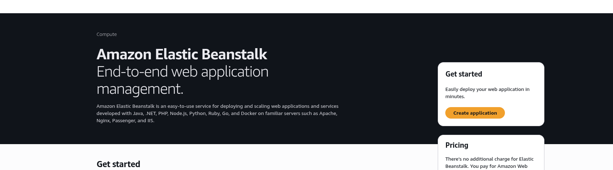

3.  Configure the application:
    *   **Application name:** `MyWebApp` (or any name you prefer).
    *   **Platform:** Select `PHP`.
    *   **Application code:** Choose `Sample application`.
    *   Click **Create application**.
    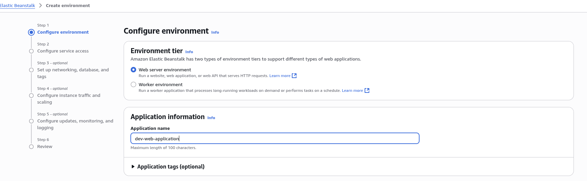
    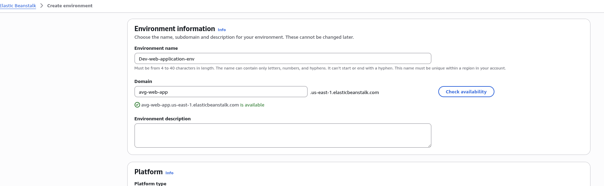
    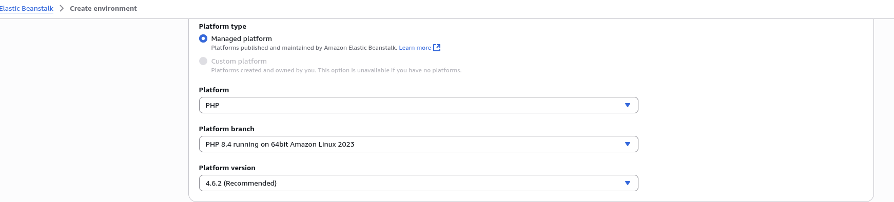
    
    

4.  Elastic Beanstalk will now begin provisioning the environment. This includes creating EC2 instances, security groups, and other necessary resources. This process may take several minutes.

    *Note: The original guide includes steps for manual role and key pair creation. The modern Elastic Beanstalk wizard handles most of this automatically. If you need a specific EC2 key pair for SSH access, you can create one in the EC2 console and attach it during the "Configure more options" step.*

    *   To create a key pair: Navigate to **EC2 > Network & Security > Key Pairs** and click **Create key pair**.
        
        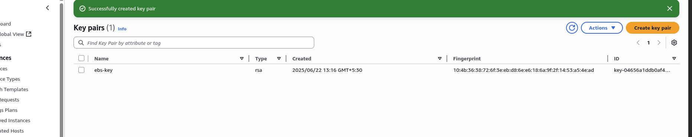

    *   You can then specify this key pair in the Elastic Beanstalk configuration under **Security**.
        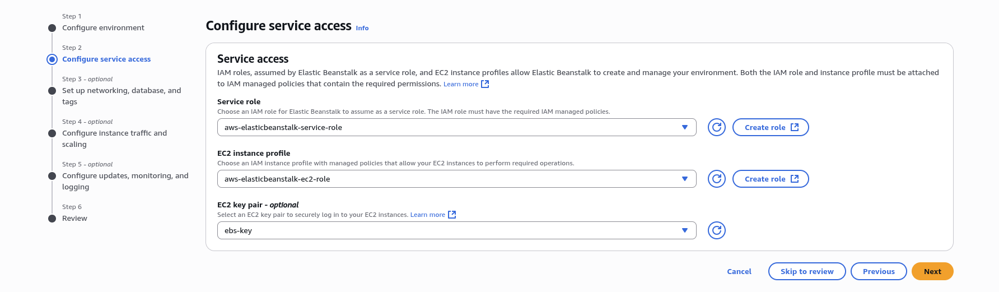

5.  Once the environment is successfully launched, you will see a green health check. Click the environment URL to see the sample application running.
    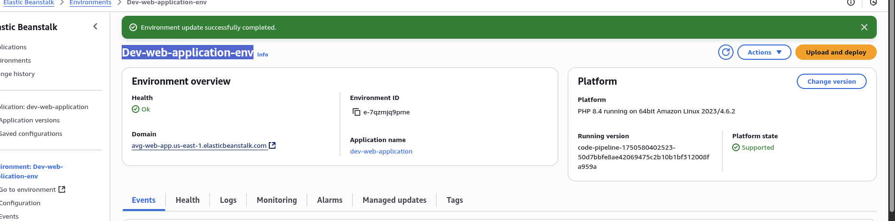
    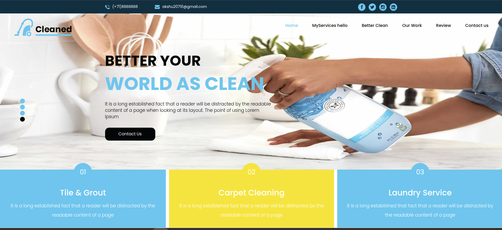

---

## Part 3: Create the CI/CD Pipeline

Now that we have a deployment target, let's create the pipeline to automate our deployments.

1.  In the AWS Console, search for and navigate to the **CodePipeline** service.
    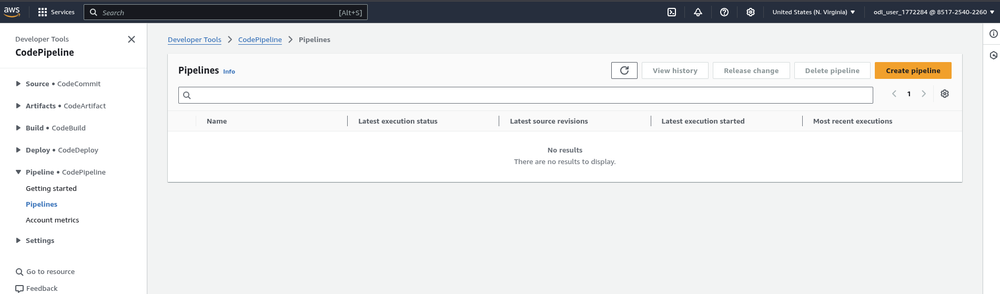

2.  Click **Create pipeline**.
    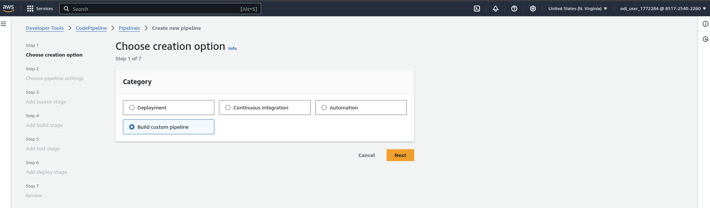

### Step 1: Pipeline settings

*   **Pipeline name:** `WebApp-Pipeline`
*   **Service role:** Select `New service role`. AWS will automatically create a role for CodePipeline to use.
*   **Advanced settings > Execution mode:** Select `Superseded`. This ensures that if you push multiple changes quickly, the pipeline will stop the older execution and start a new one with the latest commit.
*   Click **Next**.
    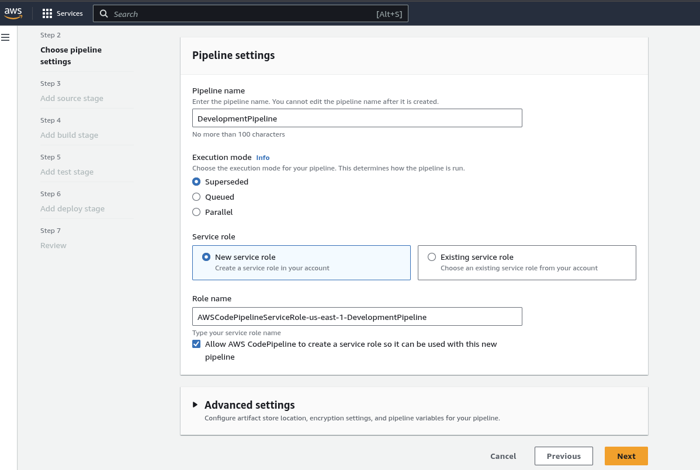

### Step 2: Source stage

*   **Source provider:** Select `GitHub (Version 2)`.
*   Click **Connect to GitHub**. A new window will pop up to authorize AWS to access your GitHub account. Give your connection a name and complete the authorization.
    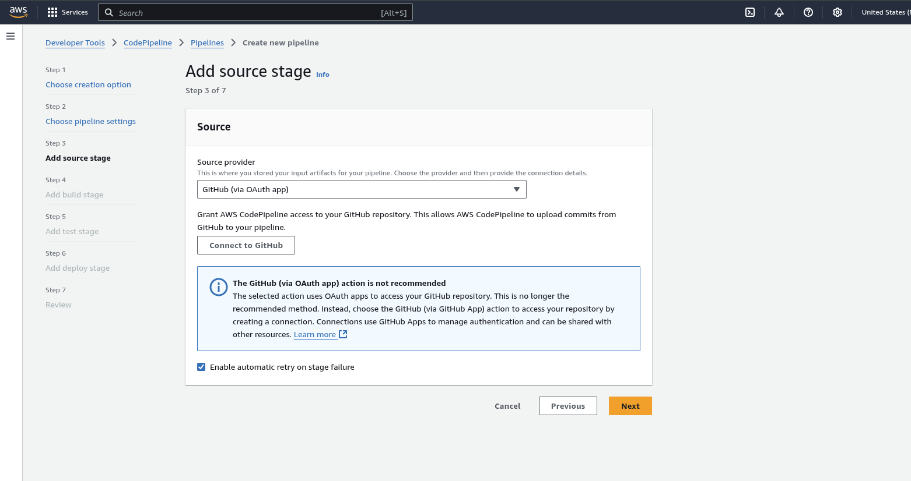
    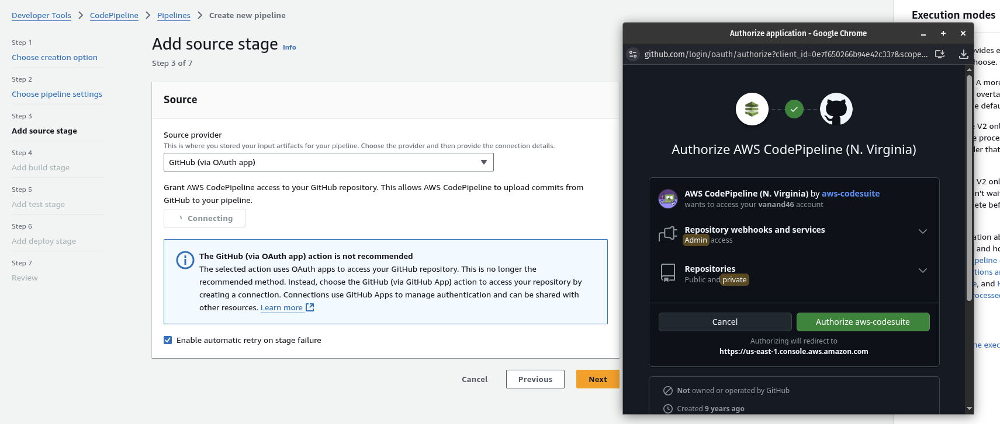
    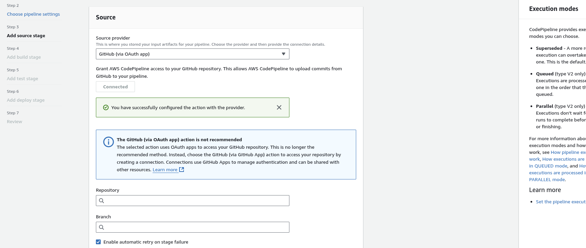
*   Once connected, select the forked repository (`apachewebsite`) from the dropdown.
*   **Branch name:** Select `master`.
*   Leave the other settings as default and click **Next**.
    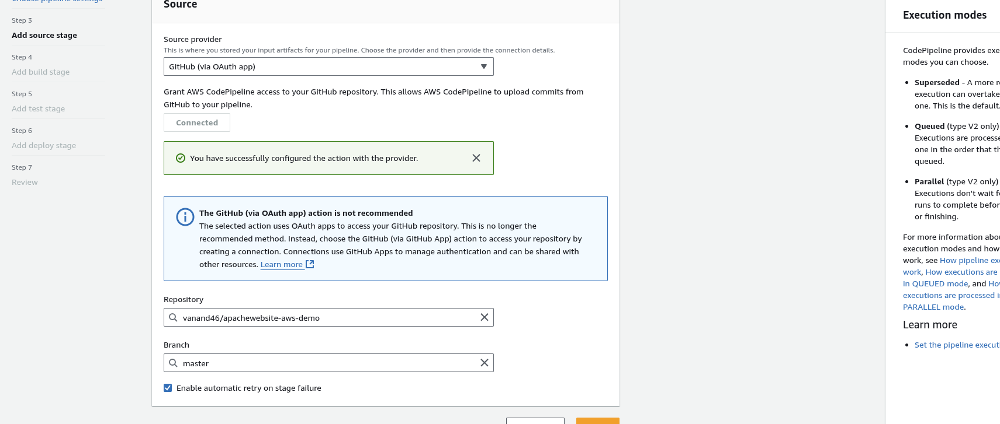

### Step 3: Build stage

*   For now, we will skip the build stage to create a simple source-to-deploy pipeline. Click **Skip build stage** and confirm. We will add a build stage later.
    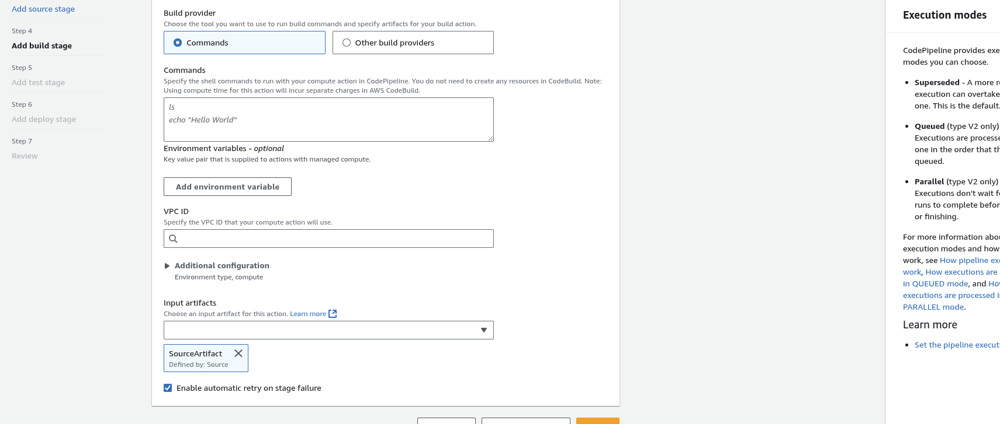

### Step 4: Deploy stage

*   **Deploy provider:** Select `AWS Elastic Beanstalk`.
*   **Region:** Ensure it's the same region where you created your Beanstalk environment.
*   **Application name:** Select `MyWebApp` (the application you created in Part 2).
*   **Environment name:** Select the environment that was created for your application.
*   Click **Next**.
    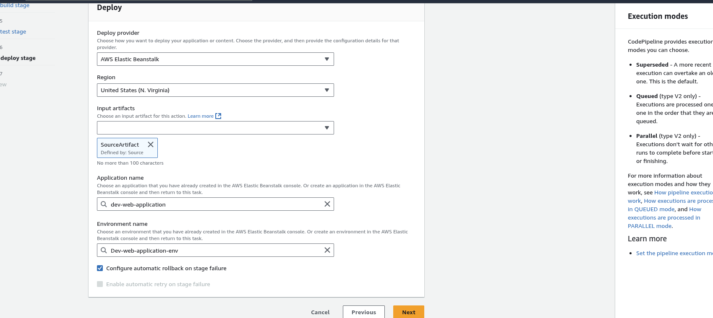

### Step 5: Review and Create

*   Review all the configurations and click **Create pipeline**.
    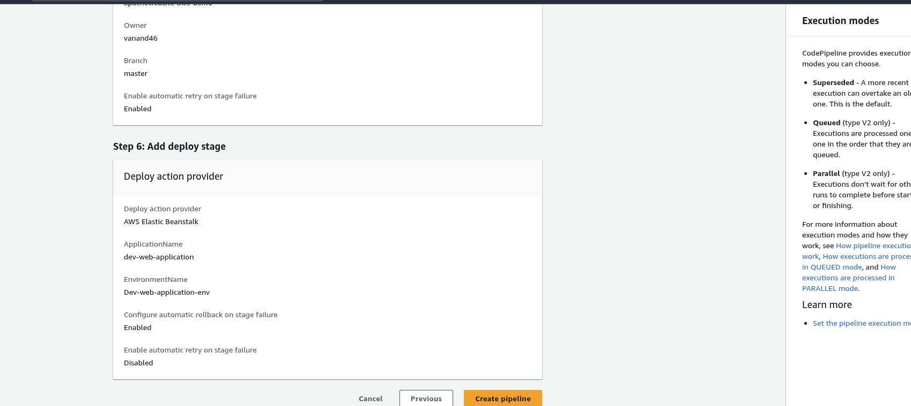

The pipeline will immediately trigger, pulling the code from GitHub and attempting to deploy it to Elastic Beanstalk.
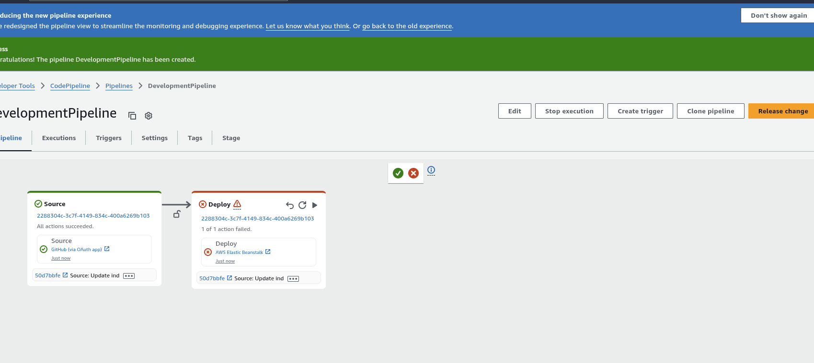

---

## Part 4: Troubleshooting the First Deployment

The initial deployment will likely fail at the "Deploy" stage. **This is expected.**

**Reason:** The service role that CodePipeline created for itself does not have the necessary permissions to perform actions on Elastic Beanstalk. We need to grant it access.

1.  In the failed pipeline view, click on the **Deploy** stage.
2.  Navigate to the **Configuration** tab for the pipeline settings and click on the **Service role ARN**. This will take you to the IAM console.
    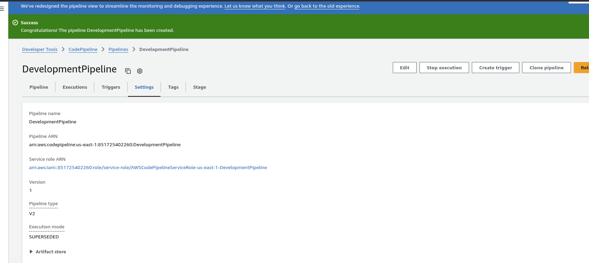

3.  In the IAM role's **Permissions** tab, click **Add permissions** > **Attach policies**.
    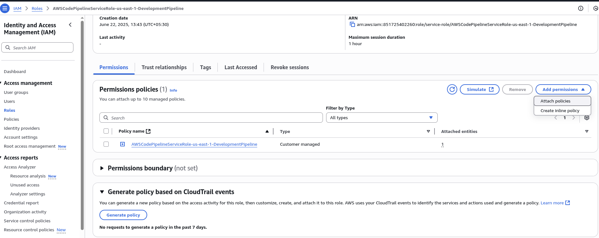

4.  Search for `AWSElasticBeanstalkFullAccess` and check the box next to it.
    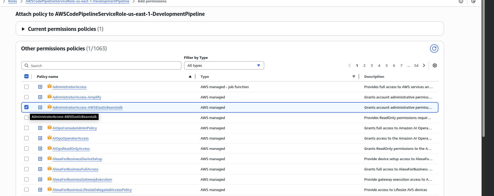

5.  Click **Add permissions**.

6.  Now, go back to your CodePipeline and click **Retry failed stage** on the "Deploy" stage.
    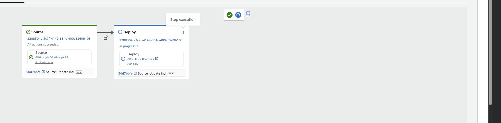

This time, the deployment should succeed! You can verify this by visiting your Elastic Beanstalk URL, which should now display the content from your forked GitHub repository.
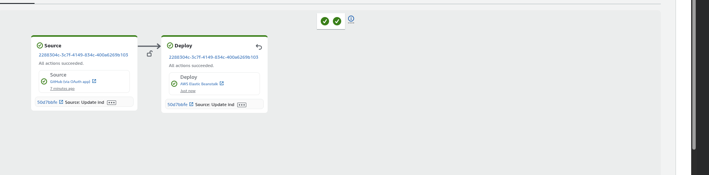

---

## Part 5: Integrating a Build Stage with AWS CodeBuild

Our current pipeline directly deploys the source code. A more robust pipeline includes a build stage for compiling code, running tests, or packaging artifacts. Let's add one using AWS CodeBuild.

Our forked repository already contains a `buildspec.yml` file. This file tells CodeBuild which commands to run.

```yml
# buildspec.yml
version: 0.2
phases:
  install:
    runtime-versions:
      php: 7.3
  build:
    commands:
      - echo "No build commands needed for this simple PHP app."
      - echo "In a real project, you might run tests or composer install here."
  post_build:
    commands:
      - echo "Build completed on `date`"
artifacts:
  files:
    - '**/*'
```
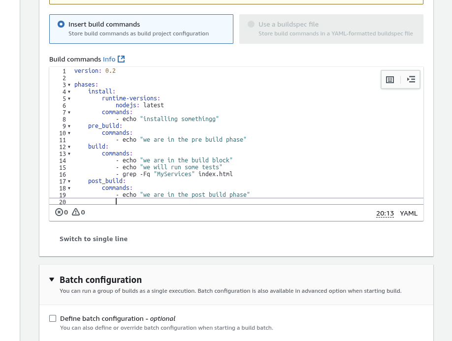

### Add the Build Stage to the Pipeline

1.  Go to your pipeline in the CodePipeline console and click **Edit**.
    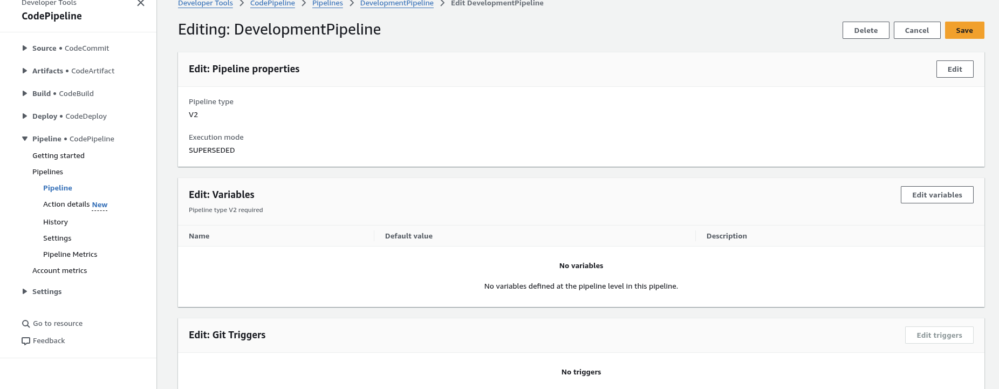

2.  Between the `Source` and `Deploy` stages, click **Add stage**.
    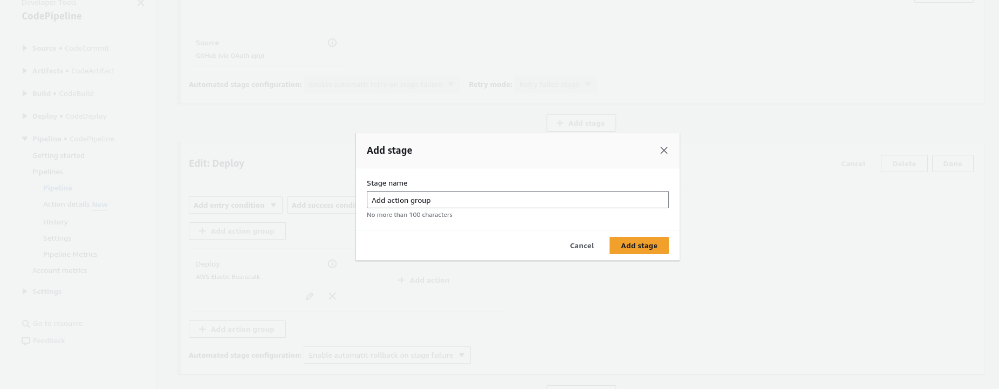

3.  Enter `Build` as the **Stage name** and click **Add stage**.
    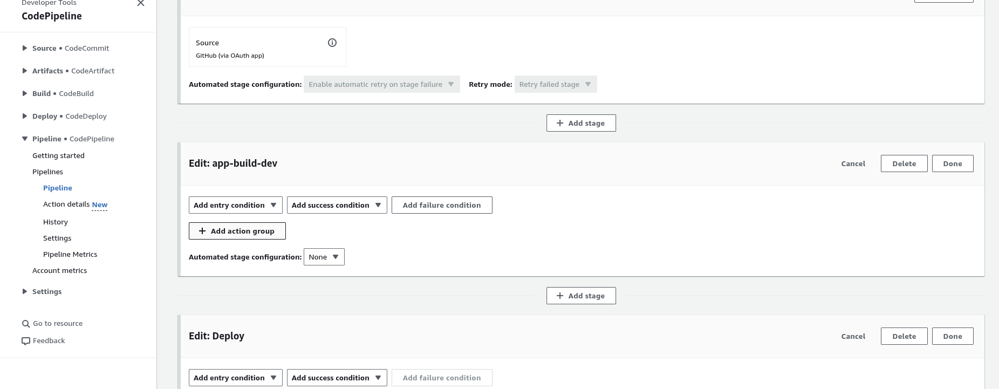

4.  In the new Build stage, click **Add action group**.
    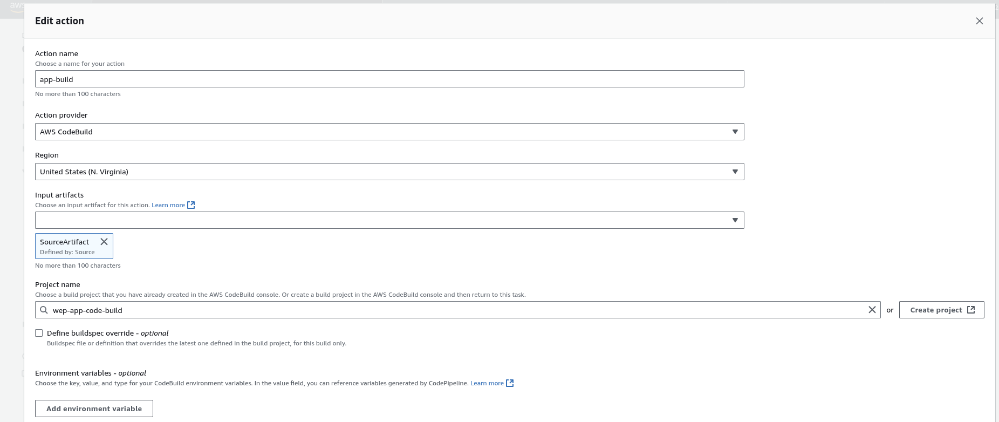

5.  Configure the build action:
    *   **Action name:** `CodeBuild-Project`
    *   **Action provider:** Select `AWS CodeBuild`.
    *   **Region:** Ensure your region is selected.
    *   **Input artifacts:** This should be pre-filled with the source artifact (`SourceArtifact`).
    *   Under **Project name**, click **Create project**. A new window will open.
        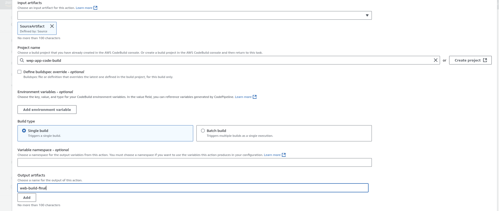

6.  **Create the CodeBuild Project:**
    *   **Project name:** `webapp-build`
    *   **Environment image:** `Managed image`
    *   **Operating System:** `Amazon Linux 2`
    *   **Runtime(s):** `Standard`
    *   **Image:** `aws/codebuild/amazonlinux2-x86_64-standard:4.0` (or a recent version)
    *   **Service role:** `New service role`. CodeBuild will create a role for itself.
    *   **Buildspec:** Leave `Use a buildspec file` selected. This tells CodeBuild to look for `buildspec.yml` in the root of your repository.
    *   Leave all other settings as default and click **Create build project**.
    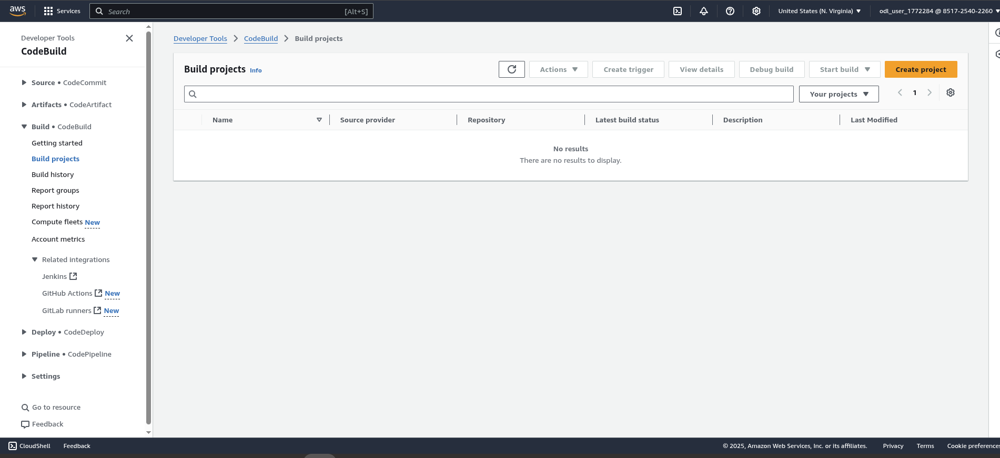
    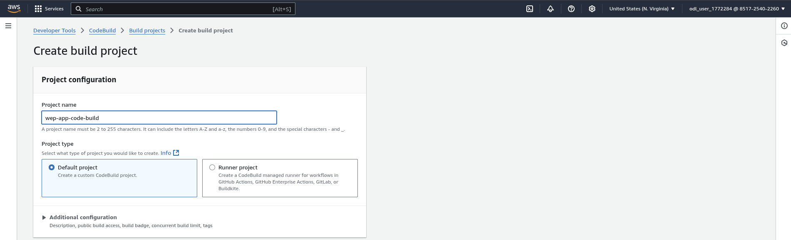
    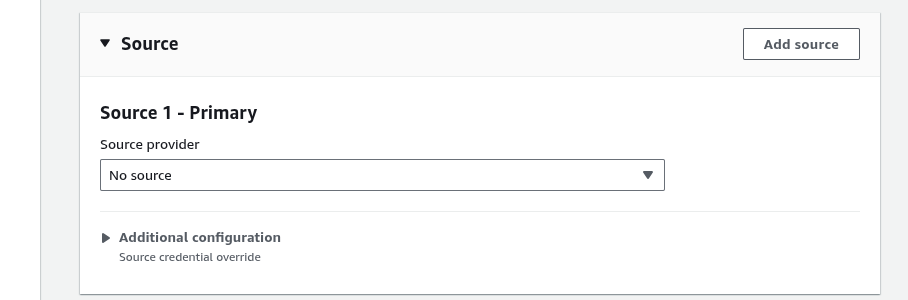
    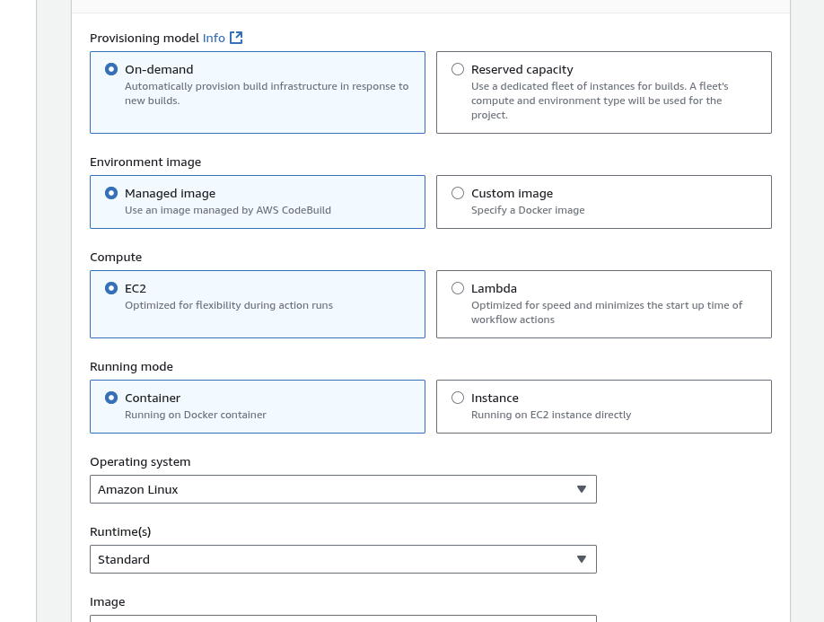
    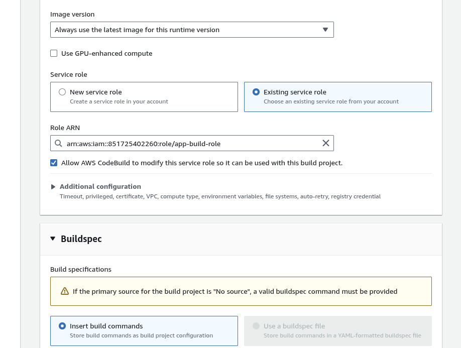

7.  Once the CodeBuild project is created, the window will close. Back in the pipeline editor, click **Done** for the action group.

8.  Click **Save** at the top right of the pipeline editor to save the new structure.

---

## Part 6: Testing the Full End-to-End Pipeline

Now let's test the complete pipeline. Any change pushed to the GitHub repository should automatically trigger the build and deploy process.

1.  Go to your forked `apachewebsite` repository on GitHub.
2.  Edit one of the files (e.g., `index.php`) and make a small visible change.
3.  Commit the change directly to the `master` branch.
4.  Navigate back to your CodePipeline in the AWS Console. You will see that it has automatically started a new execution.
5.  Watch as the pipeline progresses through the `Source`, `Build`, and `Deploy` stages.
    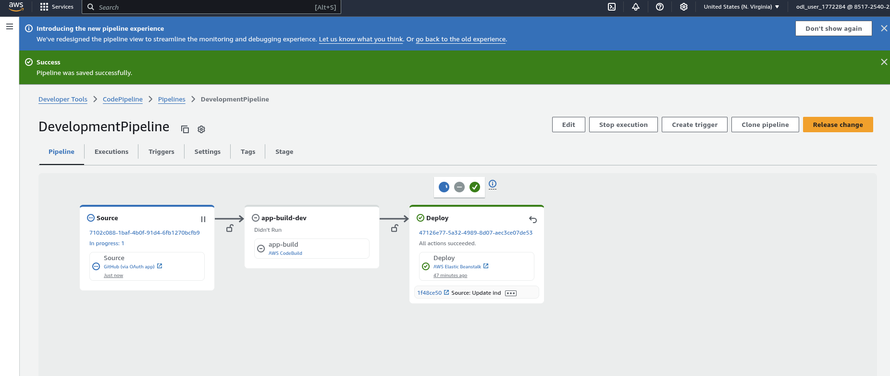
6.  Once all stages are green, refresh your Elastic Beanstalk application URL. You should see your changes live!

Congratulations! You have successfully built a fully automated CI/CD pipeline on AWS.